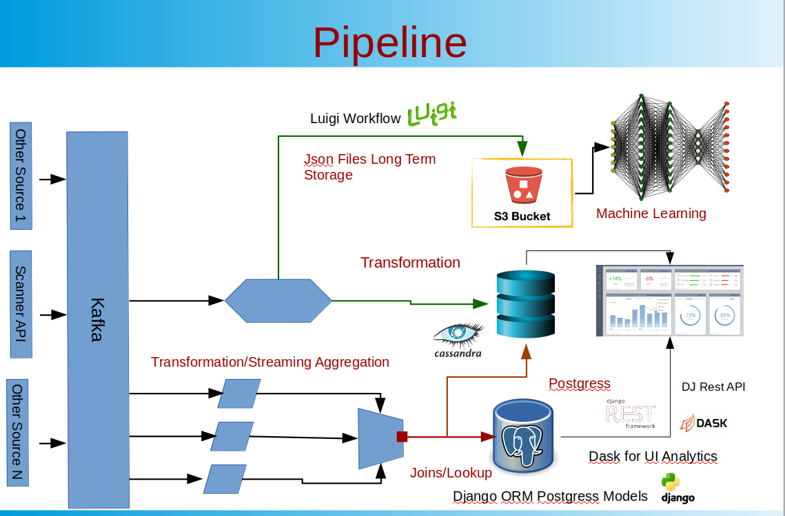
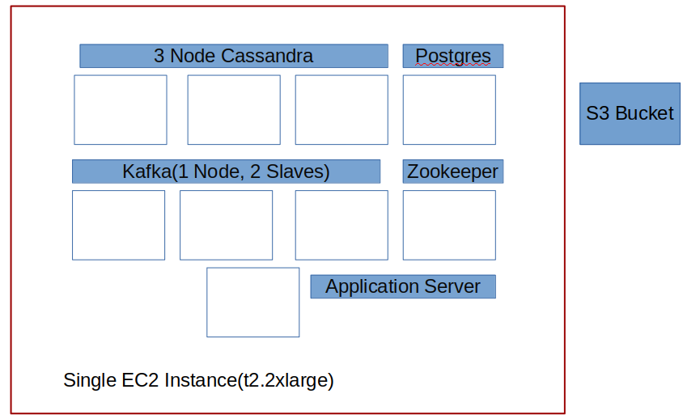

[](https://travis-ci.com/csci-e-29/2019fa-final-project-e-omollo)
# FINAL PROJECT
<!-- START doctoc generated TOC please keep comment here to allow auto update -->
<!-- DON'T EDIT THIS SECTION, INSTEAD RE-RUN doctoc TO UPDATE -->
**Table of Contents**  *generated with [DocToc](https://github.com/thlorenz/doctoc)*

- [Real Time Ticket Pricing](#real-time-ticket-pricing)

- [Architecture](#architecture)
  - [Scanner](#scanner)
  - [Kafka Producer](#kafka-producer)
  - [Kafka Consumer](#kafka-consumer)
    - [Cassandra Consumer](#cassandra-consumer)
    - [Postgres Consumer](#postgres-consumer)
    - [S3 Bucket](#S3-bucket)
  - [Django](#django)
    - [Django REST API](#django-rest-api)
  - [User Interface](#user-interface)
  
 - [Repo Layout](#repo-layout)
  
<!-- END doctoc generated TOC please keep comment here to allow auto update -->

## Real Time Ticket Pricing
Traveling and vacationing can be expensive without proper planning.  
In this project, we will gather real time ticket pricing to answer the following questions:
<ul>
    <li>What is the best time to purchase a ticket?</li>
    <li>How far ahead should tickets be purchased?</li>
    <li>Which airlines offer the best rates?</li>
</ul>

## Architecture

The architecture is configured as follows:


### Scanner
Gets real time price ticket prices from a price pricing API every 80 seconds. A single API call generates ~14 quotes

### Kafka Producer
A Kafka producer serializes and sends a key value pair topic to a 3 node kafka cluster node that is managed by Zookeeper. The kafka producer is designed with Replication factor of 2 and with 6 partitions

### Kafka Consumer
3 Consumers subscribe to the topic:

#### Cassandra Consumer: 
NO SQL Cassandra DB consumes individual quotes. The cassandra is configured with 3 datacenters: 1 node on datacenter 1 and 2 nodes on datacenter 2
Prosgres Consumer:
Consumes and provides aggregated prices of streaming data. Because we want aggregated data over multiple dimensions e.g. source, destination, departure time, arrival time, airline, we capture running counts of quotes from A to B as well sum of all tickets from A to B for every message consumed. Downstream processes then provide aggregated values based on end user input.

#### Postgres Consumer
Progres also provides a secondary advantage of allowing join tables(that is expensive under cassandra. The postgress database is normalized using snowflake schema.

#### S3 Bucket
S3 Bucket:We simultaneously store quotes received from kafka to an S3 bucket for long term storage. S3 buckets are generally cheaper than maintaining EC2 and EMR instances for long term storage. The long term data stored may be used for Machine Learning.

### Django
We use Django to develop postgres tables/models. We use a combination of Django ORM and SQLAchemy to interact with Postgres

#### Django REST API
We use Django REST API to develop UI for the live dashboards shown below

### User Interface : Demo  [Dashboard](http://18.207.253.113:8000/app/) 

To produce the dashboard, we use a combination of chart.js and jquery to perform ajax calls to the Django REST API that we developed above. We also use bootstrap for layout. This allows for the dashboards to appear correctly in both desktops and mobile devices. The kafka producer generates new messages every 80 seconds so the dashboards will update every 80 seconds with new data
Demo of the [Dashboard](http://18.207.253.113:8000/app/) 


## Repo Layout

The Repo is laid out as follows:
<ul>
    <li>consumers: Module contains cassandra and postgres consumers 
        <ul>
            <li>cassandra</li> 
            <li>postgres</li>
        </ul>
    </li>
    <li>Data Analysis: Contains code for Analytics using Dask. This code is used in Generating UI</li>
    <li>Producers: Module contains kafka producer code
        <ul>
            <li>Kafka: code for kafka producer</li> 
            <li>Scanner: code for pulling ticket pricing using scanner API</li>
        </ul>
    </li>
    <li>Web App: Django Application
        <ul>
            <li>Config: COnfiguration for Django Web app</li> 
            <li>data_app: Django application</li>
        </ul>
    </li>
    <li>Docker: We used a docker network to allow the different items to communicate</li>    
    <li>Requirements.txt: List of modoules used</li>
</ul>

Follow the steps below run 
<ol>
<li>Create the docker network and databases </li>
<li>The databases will be empty, so we need to create tables from django models </li>
<li>Create Django user admin</li>
<li>Start django web server</li>
<li>Start Kafka producer</li>
<li>Start Kafka consumer</li>

</ol>
From the root of the repo, run: <br>

```bash
docker-compose up -d --scale kafka=3
```
This will create the docker configuration below(cassandaa, kafka, zookeeper, postgres, and application server.




To start create the django admin, create postgress database and start web server, then from the docker container run 
```bash
docker exec -it price-ticketing-python bash
cd data_app
python manage.py migrate
python manage.py makemigrations data_app
python manage.py migrate
python manage.py createsuperuser
python manage.py makemigrations data_app
python manage.py migrate
python manage.py runserver 0.0.0.0:8000

```
The UI dashboard will be available at localhost:8000/app

To start the kafka producer, from the host computer, run 
```bash
docker exec -it price-ticketing-python bash
```
then from the docker container run:
```bash
python -m producers
```
The above commands will start pulling ticket pricing from the scanner network

To start the kafka consumers, from the host computer 
```bash
docker exec -it price-ticketing-python bash
```
then from the docker container run:
```bash
python -m consumer
```
The consumer will create the necessary cassandra table and will start populating the posgres tables and cassandra tables with data from kafka producer


